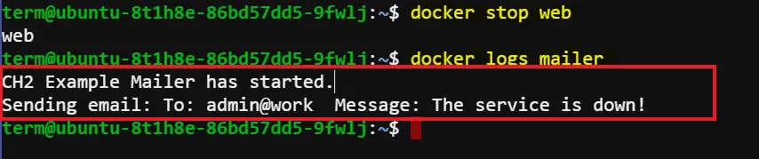
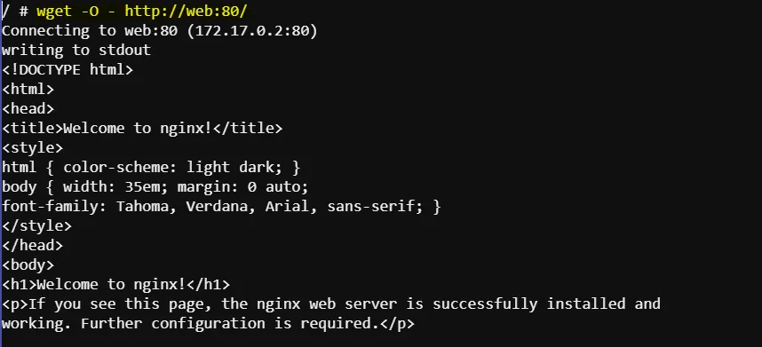
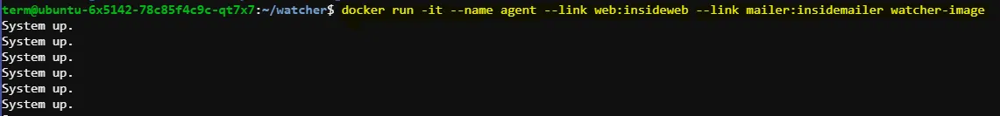

# Deploying a Monitored NGINX Web Server Using Docker

In this example, you will learn how to use Docker to install and manage a web server using NGINX, set up a monitoring system, and configure alert notifications. By following these instructions, you'll get hands-on experience with Docker's features, such as creating detached and interactive containers, managing container logs, and handling container lifecycle operations.

## Scenario Overview

We are going to create a new website that requires close monitoring. We will use NGINX for the web server and want to receive email notifications when the server goes down. The architecture will consist of three containers:

1. **Web Container**: Runs the NGINX web server.
2. **Mailer Container**: Sends email notifications.
3. **Agent Container**: Monitors the web server and triggers the mailer when the server is down.


## Creating and Starting Containers

### Step 1: Start NGINX Container

Download, install, and start an NGINX container in detached mode:

```bash
docker run -d --name web nginx:latest
```

This command:
- Downloads the latest NGINX image from Docker Hub.
- Creates and starts a container named `web` in detached mode.

### Step 2: Create and Start Mailer Container

First, create a directory to store your `mailer.sh` script and `Dockerfile`:

```bash
mkdir mailer
cd mailer
```

Create the `mailer.sh` script:

```bash
touch mailer.sh
```

Edit `mailer.sh` and add the following content:

```bash
#!/bin/sh
printf "CH2 Example Mailer has started.\n"
while true
do
    MESSAGE=`nc -l -p 33333`
    printf "Sending email: %s\n" "$MESSAGE"
    sleep 1
done
```

Create the `Dockerfile`:

```bash
touch Dockerfile
```

Edit the `Dockerfile` and add the following content:

```dockerfile
FROM busybox
COPY . /mailer
WORKDIR /mailer
RUN adduser -DHs /bin/bash example
RUN chown example mailer.sh
RUN chmod a+x mailer.sh
EXPOSE 33333
USER example
CMD ["/mailer/mailer.sh"]
```

Then, run the following command to build your Docker image:

```bash
docker build -t mailer-image .
```

After the image is built, you can move to any directory and run the container:

```bash
docker run -d --name mailer mailer-image
```

### Step 3: Start an Interactive Container for Testing

Run an interactive container linked to the `web` container to verify the web server:

```bash
docker run --interactive --tty --link web:web --name web_test busybox:latest /bin/sh
```

Inside the interactive shell, run:

```bash
wget -O - http://web:80/
```

You should see "Welcome to NGINX!" if the web server is running correctly. Exit the shell by typing `exit`.


### Step 4: Start the Agent Container

Create a directory for the watcher:

```bash
mkdir watcher
cd watcher
```

Create the `watcher.sh` script:

```bash
touch watcher.sh
```

Add the following content to `watcher.sh`:

```bash
#!/bin/sh
while true
do
    if `printf "GET / HTTP/1.0\n\n" | nc -w 2 $INSIDEWEB_PORT_80_TCP_ADDR $INSIDEWEB_PORT_80_TCP_PORT | grep -q '200 OK'`
    then
        echo "System up."
    else
        printf "To: admin@work Message: The service is down!" | nc $INSIDEMAILER_PORT_33333_TCP_ADDR $INSIDEMAILER_PORT_33333_TCP_PORT
        break
    fi
    sleep 1
done
```

Create and edit the `Dockerfile`:

```dockerfile
FROM busybox
COPY . /watcher
WORKDIR /watcher
RUN adduser -DHs /bin/bash example
RUN chown example watcher.sh
RUN chmod a+x watcher.sh
USER example
CMD ["/watcher/watcher.sh"]
```

Build and run the watcher container:

```bash
docker build -t watcher-image .
docker run -it --name agent --link web:insideweb --link mailer:insidemailer watcher-image
```

Detach from the interactive container by pressing `Ctrl + P` followed by `Ctrl + Q`.


## Managing Containers

### Step 5: List Running Containers

Check which containers are running:

```bash
docker ps
```

### Step 6: Restart Containers

If any container is not running, restart it:

```bash
docker restart web
docker restart mailer
docker restart agent
```

### Step 7: View Container Logs

Examine logs to ensure everything is running correctly:

```bash
docker logs web
docker logs mailer
docker logs agent
```

- **Web Logs**: Look for "GET / HTTP/1.0" 200 to confirm the agent is testing the web server.
- **Mailer Logs**: Ensure the mailer has started.
- **Agent Logs**: Confirm "System up." messages indicating the server is running.

### Step 8: Follow Logs

To continuously monitor logs, use the `--follow` flag:

```bash
docker logs -f agent
```

Press `Ctrl + C` to stop following the logs.

### Step 9: Test the System

Stop the web container to test the monitoring system:

```bash
docker stop web
```

Check the mailer logs to see if it recorded the service down event:

```bash
docker logs mailer
```

Look for a line like:
```
Sending email: To: admin@work Message: The service is down!
```



## Conclusion

You have successfully set up a Docker-based system with an NGINX web server, a mailer for notifications, and an agent for monitoring. You learned how to create and manage both detached and interactive containers, view logs, and handle container lifecycle operations.
